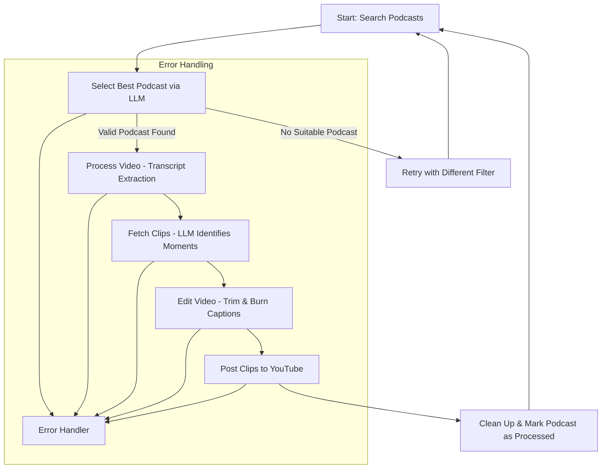

# PodPilot 

An end-to-end automation system that discovers trending podcasts, extracts highlight moments using LLMs, and publishes short-form videos to YouTube.

PodPilot handles everything — from podcast discovery to video editing and publishing — with no manual intervention.

### 🚀 How It Works
The system operates as a sophisticated pipeline, orchestrated by LangGraph:

- Search Podcasts: Queries YouTube for recent and relevant podcasts, fetching initial metadata.
- Select Best Podcast: An LLM analyzes the retrieved podcasts (excluding previously processed ones) to select the most promising candidate for clip generation. If no suitable podcast is found, it retries with different filters.
- Process Video: Downloads the selected podcast's video and extracts its transcript (captions).
- Fetch Clips (Moment Identification): An LLM processes the transcript in chunks, identifying and detailing engaging "moments" (start time, end time, title, description, keywords).
- Edit Video: For each identified moment, the system: 
  - The segment is trimmed with ffmpeg
   - Captions are burned in
   - 9:16 aspect ratio is applied with a blurred background for Shorts-style viewing
- Post Video: Uploads each generated video clip to YouTube with its AI-generated metadata.
- Clean Up & Loop: Clears local data and marks the original podcast as "burnt" (processed) before initiating the next cycle.
## Flow



### 🛠️ Tech Stack

| Component               | Purpose                                                |
| ----------------------- | ------------------------------------------------------ |
| **LangGraph**           | Orchestrates multi-step, stateful workflows            |
| **LangChain**           | Manages LLM calls and prompts                          |
| **Gemini 2.0 Flash**    | LLM used for selection and clip extraction             |
| **FFmpeg**              | Trimming, resolution adjustment, and caption embedding |
| **yt-dlp**              | Podcast discovery and video download                   |
| **YouTube Data API v3** | Video uploading                                        |
| **LangSmith**           | Observability and debugging of the LLM pipeline        |


### ⬇️ Setup and Installation
To get this project up and running locally, follow these steps:
Clone the repository:

Create a virtual environment (recommended):
python -m venv venv
source venv/bin/activate # On Windows: `venv\Scripts\activate`

Install dependencies:
pip install -r requirements.txt

Set up environment variables:
Create a .env file in the root directory of the project and add your API keys:

GOOGLE_API_KEY="*your_api_key*"
LANGSMITH_TRACING=true
LANGSMITH_ENDPOINT="https://api.smith.langchain.com"
LANGSMITH_API_KEY="*your_langsmith_api_key*"
LANGSMITH_PROJECT="*project_name*"

- Refer to Google Cloud documentation for obtaining a Gemini API key and its client secrets also obtain client secrets for after enabling the youtub v3 api from the google cloud console add desktop client add in it  http://localhost:8080 download the client_secret.json
- The first time you run the upload file it will ask a token which you can generate  by logging in provided url by the program, after first time it will create `yt_upload.py-oauth2.json` to upload in future
- Install ffmpeg: This project relies on ffmpeg for video processing. Download and install it for your operating system from the official FFmpeg website and ensure it's accessible in your system's PATH.
- Install Yt Dlp - [Guide](https://github.com/yt-dlp/yt-dlp/wiki/Installation) to install , after installing add your browser cookies using [this](https://chromewebstore.google.com/detail/get-cookiestxt-locally/cclelndahbckbenkjhflpdbgdldlbecc) extension [check here](https://github.com/user-attachments/assets/9ae91a86-d44e-402e-81ae-47cb5e54c1de)  store cookies in `cookie.txt` in the same folder for full guide about cookies in ytdlp - [here](https://github.com/yt-dlp/yt-dlp/wiki/Extractors)
### 🏃‍♀️ Usage
- Once set up, you can run the main automation script:
python agent.py
The script will begin its cycle of searching, processing, and uploading. Output messages will be printed to the console indicating the progress.
- For customization you can edits the prompts in prompts.py yourself to get the output for your needs.
- You can change the model name and args inside the agent file to get best out of the llm.


### 🤖Automation
You can automate this agent to run using the crontab in linux
make a shell script for ex:
```
#!/bin/bash

# Navigate to your project directory
cd ./Agent
# Activate your virtual environment (if applicable)
source venv/bin/activate

# Run your Python script
python agent.py

# Deactivate the virtual environment (optional)
deactivate
```

`chmod +x ./agent.sh`

add to crontab 

`$ crontab -e`
for example to run every day at 19:30

`30 19 * * * /home/ubuntu/agent.sh >> /home/ubuntu/agent_output.log 2>&1`

add this to crontab


#### Screenshots 

<div style="display: flex; justify-content: space-between;">
  
  
</div>


